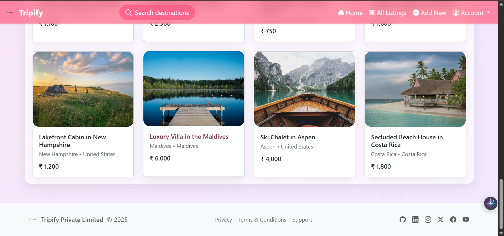

# Tripify

Tripify is a travel listing web app designed to help users discover, list, and manage vacation rentals and destinations.

> **Note:** This is the first phase of development for my college project.  
> I plan to continue working on Tripify and add more features after October.

---

## 🖼️ Preview

Explore the current look and feel of Tripify below:

### Home & Search

### Listings Overview

### Add New Listing

### Listing Details

---

## ✨ Features (Phase 1)
- Browse travel destinations and vacation rentals
- Search for listings by destination
- Add new property listings
- View detailed listing information
- Edit and delete your listings

---

## ⚙️ Tech Stack

- **JavaScript**
- **EJS**
- **CSS**

---

## 🚀 Roadmap

- 📅 Next development phase planned for October (after college project)
- Future features may include:
  - User authentication & profiles
  - Booking functionality
  - Reviews & ratings
  - Advanced filtering and sorting

---

## 📦 How to Run

> Setup and usage instructions will be added in the next phase.

---

## 📝 License

MIT

---

*Made with ❤️ by [ayusshs16](https://github.com/ayusshs16)*
